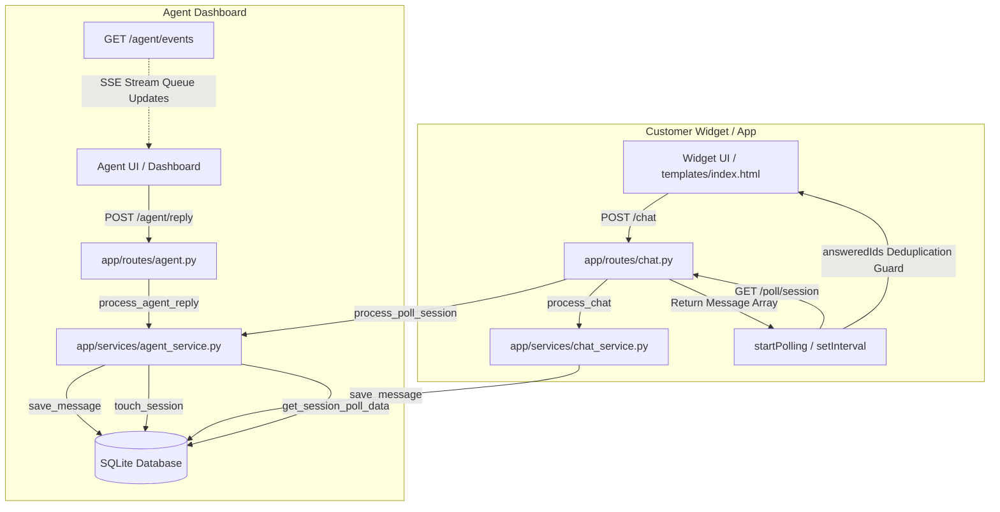

# Real-Time Messaging Architecture Audit Report

## 1. Current Architecture Diagram

---

## 2. Files Inspected

1. [app/routes/agent.py](file:///Users/nivash/AV/AI_Chat_Bot/app/routes/agent.py)
2. [app/services/agent_service.py](file:///Users/nivash/AV/AI_Chat_Bot/app/services/agent_service.py)
3. [app/routes/chat.py](file:///Users/nivash/AV/AI_Chat_Bot/app/routes/chat.py)
4. [app/database/database.py](file:///Users/nivash/AV/AI_Chat_Bot/app/database/database.py)
5. [templates/index.html](file:///Users/nivash/AV/AI_Chat_Bot/templates/index.html)
6. [static/widget_content.js](file:///Users/nivash/AV/AI_Chat_Bot/static/widget_content.js)

---

## 3. Issues Found

### Issue 1: Redundant & Multiple EventSource Connections on SSE Reconnect Loop
- **Location**: [app/routes/agent.py](file:///Users/nivash/AV/AI_Chat_Bot/app/routes/agent.py) (L527: `connectSSE()`)
- **Description**: The browser's native `EventSource` object has a **built-in automatic reconnection mechanism** with exponential backoff. In `connectSSE()`, the `onerror` handler is registered as `sseConn.onerror = function() { setTimeout(connectSSE, 5000); };`. When the connection is interrupted:
  1. The browser fires the `onerror` event and schedules its own background reconnect.
  2. The custom callback fires `setTimeout` and creates a **new `EventSource` instance** 5 seconds later.
  3. If the connection fails repeatedly, multiple timeouts can stack up, leading to overlapping reconnections and potential multiple active EventSource instances if they do not resolve cleanly.
- **Severity**: 🟠 **MEDIUM**
- **Recommended Fix**: Rely on the browser's native auto-reconnect behavior of `EventSource` instead of manually recreating the object on `onerror`. Simply remove the `setTimeout(connectSSE, 5000)` reconnect loop from `onerror`.

---

### Issue 2: answeredIds Cache Leak Across Conversations (Conversation Restart)
- **Location**: 
  - [templates/index.html](file:///Users/nivash/AV/AI_Chat_Bot/templates/index.html) (L2138: `restart()`)
  - [static/widget_content.js](file:///Users/nivash/AV/AI_Chat_Bot/static/widget_content.js) (L781: `restart()`)
- **Description**: When `restart()` is called to start a new chat conversation, `sessId` is randomized and state variables are reset, but the duplicate tracking cache `answeredIds` is **not cleared**. Since SQLite uses a global auto-incrementing key for message IDs, new messages in the new session will have higher IDs and will not be blocked. However, if the database is reset or if the user performs many restarts, this cache persists as a minor memory leak.
- **Severity**: 🟡 **LOW**
- **Recommended Fix**: Add `answeredIds = {};` inside the `restart()` function in both `templates/index.html` and `static/widget_content.js`.

---

### Issue 3: In-flight Race Condition in syncThenPoll()
- **Location**: 
  - [templates/index.html](file:///Users/nivash/AV/AI_Chat_Bot/templates/index.html) (L2162: `syncThenPoll()`)
  - [static/widget_content.js](file:///Users/nivash/AV/AI_Chat_Bot/static/widget_content.js) (L695: `syncThenPoll()`)
- **Description**: `syncThenPoll()` guards against starting multiple timers using `if (pollTimer) return;`. However, during the asynchronous catch-up `fetch(...)` request, `pollTimer` is still `null`. If a user performs rapid actions that trigger `syncThenPoll()` multiple times concurrently before the fetch resolves, multiple parallel fetches are fired. While they eventually resolve sequentially and only one `setInterval` is created, it causes redundant network requests.
- **Severity**: 🟡 **LOW**
- **Recommended Fix**: Use a boolean flag (e.g., `var syncInFlight = false;`) to guard `syncThenPoll()` while the catch-up request is pending, resetting it once `startPolling()` is called.

---

## 4. Tracing Verification

### Trace 1: Message Rendering deduplication
- Database writes a single record with auto-increment ID `m.id`.
- `/poll` returns new messages.
- The client receives the message array.
- Loop checks `if (answeredIds[m.id]) return;` first.
- Renders the message and marks `answeredIds[m.id] = true;`.
- **Verdict**: Verified. Duplicate rendering of any retrieved message is physically impossible on the frontend.

### Trace 2: Agent Reply Flow
- Agent types reply in Dashboard → calls `POST /agent/reply`.
- Endpoint calls `process_agent_reply` → calls `save_message(..., "assistant", ...)` once.
- Message is stored in the database with a single unique ID.
- Widget's `pollTimer` loop fetches from `/poll` using `since_id`.
- Loop receives the reply, validates it against `answeredIds`, and renders once.
- **Verdict**: Verified. Agent replies cannot bypass the client deduplication guard.

### Trace 3: Session Lifecycle & Timers
- **New Session**: Clean state, no poll timer.
- **Refresh**: All JS execution states, intervals, and EventSource instances are wiped and rebuilt.
- **Reconnect**: Client-side interval continues on timer ticks; errors are caught gracefully.
- **Agent Claim**: Live agent status is updated; client receives claim notification via poll and continues polling.
- **Agent Close**: Server updates status to `"closed"` and writes a closure system message. Client fetches the closure message, displays it, and triggers `clearInterval(pollTimer); pollTimer = null;` to release resources.
- **Widget Reopen**: Simply toggles CSS visibility styles; polling timers and variables are fully preserved.
- **Verdict**: Verified. Lifecycle states transition cleanly.
