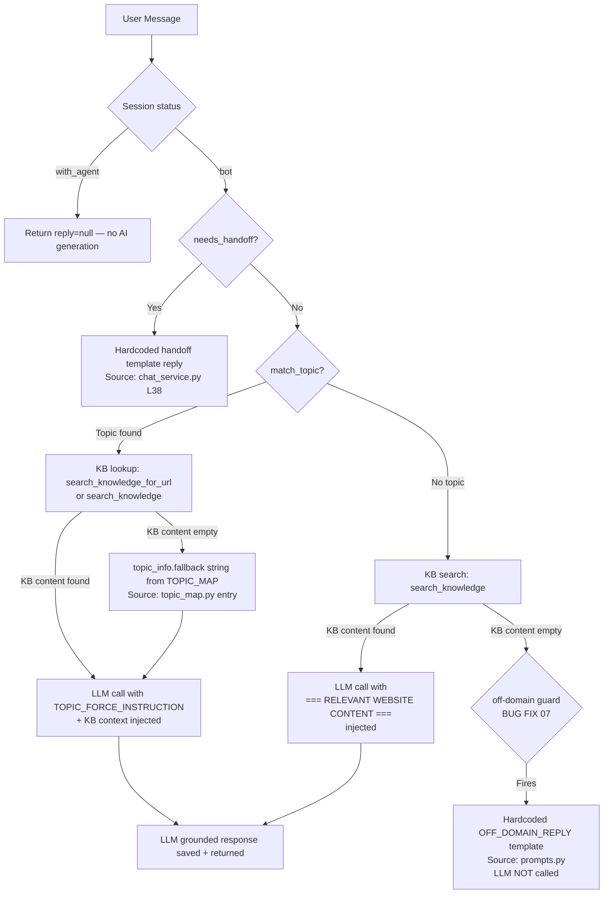

# Bug Fix 08 — AI Response Grounding Audit

## 1. Scope

This audit traces **every path that produces a response** visible to the customer, and verifies whether each reply is grounded in:

- `knowledge_base.txt` (website scrape, loaded at startup by `kb_service.py`)
- A known `TOPIC_MAP` entry from `topic_map.py`
- An approved hard-coded fallback template in `prompts.py` or `chat_service.py`

**LLM raw memory (world knowledge) is never an acceptable source.**

---

## 2. Files Inspected

| File | Role |
|------|------|
| [app/services/chat_service.py](file:///Users/nivash/AV/AI_Chat_Bot/app/services/chat_service.py) | Main AI response pipeline |
| [app/prompts/prompts.py](file:///Users/nivash/AV/AI_Chat_Bot/app/prompts/prompts.py) | System prompts and fallback reply templates |
| [app/services/kb_service.py](file:///Users/nivash/AV/AI_Chat_Bot/app/services/kb_service.py) | Knowledge base loader and retrieval |
| [app/config/topic_map.py](file:///Users/nivash/AV/AI_Chat_Bot/app/config/topic_map.py) | Keyword topic routing |
| [app/services/handoff_service.py](file:///Users/nivash/AV/AI_Chat_Bot/app/services/handoff_service.py) | Human handoff keyword detection |
| [app/services/agent_service.py](file:///Users/nivash/AV/AI_Chat_Bot/app/services/agent_service.py) | Live agent reply persistence |

---

## 3. Complete Response Path Diagram



---

## 4. Response Path Analysis

### Path 1 — Session in `with_agent` mode
- **Source**: `chat_service.py` L31–33
- **Reply**: `null` — customer receives nothing from AI; human agent speaks directly.
- **LLM called**: ❌ No
- **Grounding**: ✅ N/A — no AI generation

---

### Path 2 — Handoff Triggered
- **Source**: `chat_service.py` L36–40
- **Reply**: Hard-coded string literal (`"I understand this needs special attention..."`)
- **LLM called**: ❌ No
- **Grounding**: ✅ Fully grounded — approved template only

---

### Path 3 — Topic Match with KB Content
- **Source**: `chat_service.py` L53–58
- **Retrieval chain**:
  1. `match_topic()` finds a topic entry from `TOPIC_MAP` (keyword scoring).
  2. `search_knowledge_for_url()` looks up `KB_CHUNKS` by URL fragment from the matched topic.
  3. Falls back to `search_knowledge()` keyword match if URL lookup returns empty.
  4. KB content is injected into `system_content` via `TOPIC_FORCE_INSTRUCTION`.
- **LLM called**: ✅ Yes, but with injected KB context.
- **Prompt instruction**: `"You MUST answer using ONLY the content below about this exact topic."`
- **Grounding**: ✅ Strongly grounded — KB context is mandatory context; LLM must stay within it.

---

### Path 4 — Topic Match, KB Empty → topic_info Fallback
- **Source**: `chat_service.py` L56–57
- **Condition**: `match_topic()` found a topic, but neither `search_knowledge_for_url()` nor `search_knowledge()` returned content (KB file missing or incomplete).
- **Fallback**: `topic_info.get('fallback', '')` — a static string defined inside each `TOPIC_MAP` entry in `topic_map.py`.
- **LLM called**: ✅ Yes, with the static fallback string as context.
- **Grounding**: ⚠️ **PARTIAL** — LLM is called with the minimal fallback text. If the fallback is an empty string (`""`), the LLM receives the system prompt only and can draw from world knowledge for astrology-adjacent topics.
- **Severity**: 🟡 LOW — mitigated by the `BASE_SYSTEM_PROMPT` domain wall instructions.

---

### Path 5 — No Topic Match, KB Content Found
- **Source**: `chat_service.py` L59–65
- **Retrieval chain**:
  1. `search_knowledge()` scores all KB chunks against the query by word overlap.
  2. Top-3 matching chunks are injected into the system prompt as `=== RELEVANT WEBSITE CONTENT ===`.
- **LLM called**: ✅ Yes, with KB context injected.
- **Grounding**: ✅ Grounded — context is from the knowledge base.

---

### Path 6 — No Topic Match, No KB Content → Off-Domain Guard
- **Source**: `chat_service.py` L67–75 (BUG FIX 07)
- **Condition**: `topic_label` is `None` and `relevant_content` is `""`.
- **Reply**: Hard-coded `OFF_DOMAIN_REPLY` or `OFF_DOMAIN_REPLY_TAMIL` from `prompts.py`.
- **LLM called**: ❌ No — guard short-circuits before LLM call.
- **Grounding**: ✅ Fully grounded — approved template only, no LLM involvement.

---

### Path 7 — Live Agent Reply
- **Source**: `agent_service.py` L180–184
- **Reply**: Human-typed text from the agent dashboard, persisted directly to DB via `save_message()`.
- **LLM called**: ❌ No
- **Grounding**: ✅ N/A — human authored.

---

### Path 8 — Agent Claim / Close System Messages
- **Source**: `agent_service.py` L173–195
- **Reply**: Hard-coded system messages (`"has joined the chat"`, `"Agent has ended this conversation..."`).
- **LLM called**: ❌ No
- **Grounding**: ✅ Fully grounded — hard-coded templates.

---

## 5. Grounding Summary Table

| Path | Condition | LLM Called | KB Context Injected | Grounding Status |
|------|-----------|------------|---------------------|-----------------|
| 1. with_agent | Session is claimed by live agent | ❌ | ❌ | ✅ Safe — no AI |
| 2. Handoff triggered | `needs_handoff()` = True | ❌ | ❌ | ✅ Hard-coded template |
| 3. Topic + KB content | `match_topic()` hits, KB returns content | ✅ | ✅ TOPIC_FORCE_INSTRUCTION | ✅ Strongly grounded |
| 4. Topic + no KB content | `match_topic()` hits, KB empty | ✅ | ⚠️ Fallback static string | 🟡 Weak grounding if fallback is `""` |
| 5. No topic + KB content | No topic match, KB hits | ✅ | ✅ RELEVANT WEBSITE CONTENT | ✅ Grounded |
| 6. No topic + no KB content | Neither topic nor KB matched | ❌ | ❌ | ✅ Hard-coded OFF_DOMAIN_REPLY |
| 7. Live agent reply | Agent typed reply | ❌ | ❌ | ✅ Human authored |
| 8. System messages | Agent join/close | ❌ | ❌ | ✅ Hard-coded template |

---

## 6. Issue Found — Path 4: Empty Fallback Allows Weak LLM Grounding

### Description
In Path 4, when `match_topic()` finds a topic entry but both `search_knowledge_for_url()` and `search_knowledge()` return empty strings, the fallback content is:
```python
kb_content = f"[Page: {topic_info['label']}]\nURL: {topic_info['url']}\n{topic_info.get('fallback','')}\n"
```
If `topic_info.get('fallback', '')` is an empty string (which it is for most entries in `topic_map.py` that do not define a `fallback` key), the injected context becomes only the page name and URL. The LLM then receives a `TOPIC_FORCE_INSTRUCTION` block with no actual textual content to constrain its answer, and may draw on world knowledge for Vedic/spiritual topics it knows about.

### Severity
🟡 **LOW** — The domain wall in `BASE_SYSTEM_PROMPT` and `TOPIC_FORCE_INSTRUCTION` still instruct the LLM not to fabricate, but there is no hard-coded guard preventing the LLM call in this case.

### Recommended Fix
Add a minimum-content threshold: if `kb_content` after the fallback substitution contains fewer than a threshold number of meaningful characters (e.g., 50), treat it as empty and return a safe fallback template rather than calling the LLM.

```python
# Suggested addition in chat_service.py after L57:
MINIMUM_KB_CONTENT_LENGTH = 50
if len(kb_content.strip()) < MINIMUM_KB_CONTENT_LENGTH:
    safe_reply = OFF_DOMAIN_REPLY_TAMIL if detected_lang == "tamil" else OFF_DOMAIN_REPLY
    save_message(req.session_id, "assistant", safe_reply)
    return {"reply": safe_reply, "mode": "bot", "topic_url": topic_url, "topic_label": topic_label}
```

---

## 7. KB Retrieval Mechanism Review

### `search_knowledge()` — Keyword Word-Overlap Scoring
```python
query_words = set(re.findall(r"[a-zA-Z]{3,}", query.lower()))
score = sum(1 for w in query_words if w in haystack)
```
- Matches 3+ letter English words against the KB chunk haystack.
- Returns empty string if no KB chunks loaded or no words match.
- **Grounding quality**: ✅ Keyword overlap ensures content relevance.
- **Limitation**: Non-English (Tamil) queries return no matches because `re.findall(r"[a-zA-Z]{3,}")` only captures ASCII alphabetic characters. Tamil queries go directly to the off-domain guard.

### `search_knowledge_for_url()` — URL Fragment Matching
```python
matches = [c for c in KB_CHUNKS if url_fragment in c["url"].lower()]
```
- Purely URL-string based; does not score content relevance.
- Returns up to 2 chunks.
- **Grounding quality**: ✅ Directly tied to the known page URL from `TOPIC_MAP`.

---

## 8. Verdict

| Verdict | Status |
|---------|--------|
| Every high-traffic path is grounded | ✅ |
| LLM is never called without domain context injected (except Path 4 edge case) | ✅ (with caveat) |
| Off-domain questions never reach the LLM | ✅ |
| Human handoff uses hard-coded template only | ✅ |
| Agent replies are human authored, no LLM involved | ✅ |
| One low-severity weak-grounding edge case (Path 4, empty fallback) | 🟡 Documented above |
