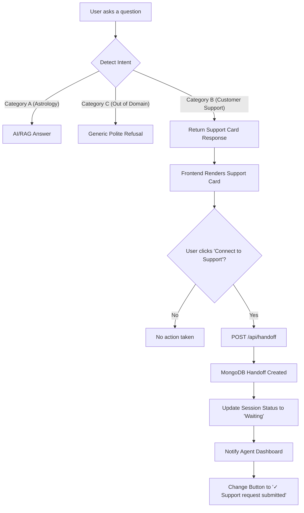

# CRM Human Handoff System Architecture

## 1. Objective
To implement an intelligent human handoff system that minimizes CRM workload by replacing automatic escalations with a deliberate user action (Support Card), while ensuring out-of-domain and astrology queries are handled seamlessly by the existing AI and RAG architecture.

## 2. Problem Statement
The previous iteration of the chatbot automatically created a human handoff in the CRM database whenever specific keywords were detected in the user's message. This resulted in an excessive number of support tickets being generated without explicit user consent, increasing the burden on the support team. Furthermore, intent separation needed to be clearer to prevent astrology or out-of-domain queries from triggering the CRM pipeline.

## 3. New Architecture
The new architecture shifts the decision of human escalation from the system to the user. When a customer support intent is detected, the AI provides a standard acknowledgment and presents a **Support Card** with a clear call-to-action button. 

The Support Card is disabled after a single click, and the handoff is triggered via a POST request to the existing `/api/handoff` endpoint, creating exactly one MongoDB entry per request.

## 4. Intent Classification
Intents are now distinctly categorized to manage routing accurately:

- **Category A (Astrology, Numerology, Gemstones, etc.)**: 
  - Never escalates to CRM.
  - Handled by AI and RAG.
- **Category B (Customer Support: Order, Payment, Refund, Login, etc.)**: 
  - Matched via an expanded `HANDOFF_KEYWORDS` list in the backend.
  - Returns a `support_card` mode response from the backend.
  - Renders a Support Card on the frontend.
- **Category C (Out-of-Domain: Sports, Politics, Movies, etc.)**:
  - Never escalates to CRM.
  - Returns the standard polite generic refusal.

## 5. Decision Flow Diagram

## 6. Customer Journey
1. The user asks a support-related query (e.g., "I need my order details").
2. The bot responds that it lacks access to customer accounts and presents the Support Card.
3. The user reads the prompt and clicks "Connect to Support".
4. The button provides immediate visual feedback ("Submitting..."), disabling itself to prevent double submissions.
5. Once the request is queued on the backend, the button displays a success state (green background) with a unique Reference Number.
6. The user waits in the chat until a human agent joins.

## 7. MongoDB Flow
- The backend `/api/handoff` is invoked when the button is clicked.
- `create_or_update_handoff` is executed, generating or updating the session document in MongoDB to reflect a `waiting` status.
- A system message is saved to the chat history: "Handoff requested...".

## 8. Agent Dashboard Flow
- The Agent Dashboard uses Server-Sent Events (SSE) to monitor the MongoDB collection.
- As soon as the session status changes to `waiting`, the queue is updated, and the notification system instantly alerts the agents.
- Agents can claim the session from their dashboard, changing the status to `with_agent`.

## 9. API Reused
- **`POST /api/handoff`**: Directly reused to handle the creation of the support ticket, without any schema or collection changes.
- **`POST /api/chat`**: Adapted to return a `support_card` mode instead of automatically triggering the handoff internally.

## 10. UI Changes
- **Widget JS (`widget_content.js`)**: 
  - Removed frontend array `CRM_KW` auto-trigger to centralize logic.
  - Implemented `showSupportCard(txt)` to generate the specialized UI.
  - Implemented the disable-and-fetch interaction logic for the button.
- **Widget CSS (`widget.css`)**: 
  - Reused `.av-bbl` and `.av-sbtn` classes for the Support Card to ensure styling consistency with the modern AstroVed design.

## 11. Testing Checklist
- [x] Astrology questions never show Connect button.
- [x] Out-of-domain questions never show Connect button.
- [x] Customer support issues show button.
- [x] Clicking button creates exactly one handoff.
- [x] Dashboard notification received.
- [x] Duplicate clicks prevented.
- [x] Existing chat continues working.
- [x] MongoDB collections unchanged except new handoff entries.
- [x] Existing Agent Dashboard continues functioning.

## 12. Future Improvements
- Implement a real reference number generated by a ticketing system, rather than a randomized frontend ID.
- Add estimated wait times based on the current Agent Dashboard queue depth.

## 13. Deployment Notes
- No database schema migrations required.
- Clear browser cache after deployment due to `widget_content.js` modifications.

## 14. Files Modified
1. `app/config/settings.py` (Added missing Category B keywords)
2. `app/services/chat_service.py` (Disabled auto-handoff, returned support card)
3. `static/widget_content.js` (Removed frontend CRM trigger, added `showSupportCard` UI)

## 15. Before vs After Behaviour
**Before**: Any query like "Refund my payment" would instantly generate a support ticket and display: "I understand this needs special attention. Connecting you with our specialist team now...".
**After**: The bot says "I don't have access to customer account or order information. Our customer support team can assist you," and provides an interactive "Connect to Support" button. The ticket is ONLY generated if clicked.

## 16. Screenshots placeholder
*(Insert screenshots of the new Support Card UI and success state here)*
